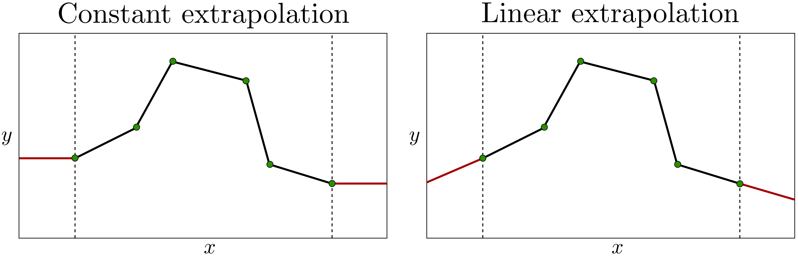
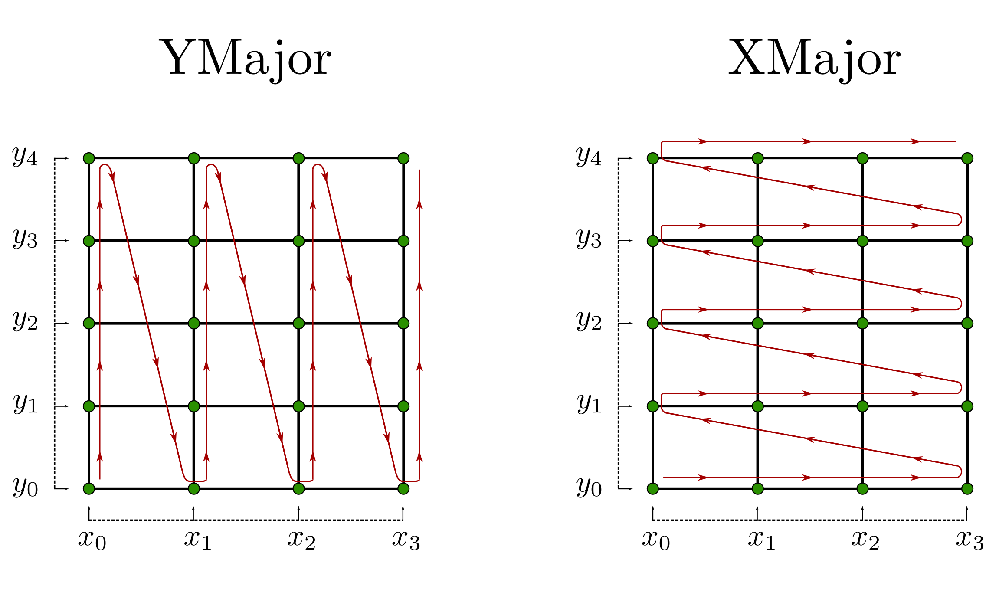
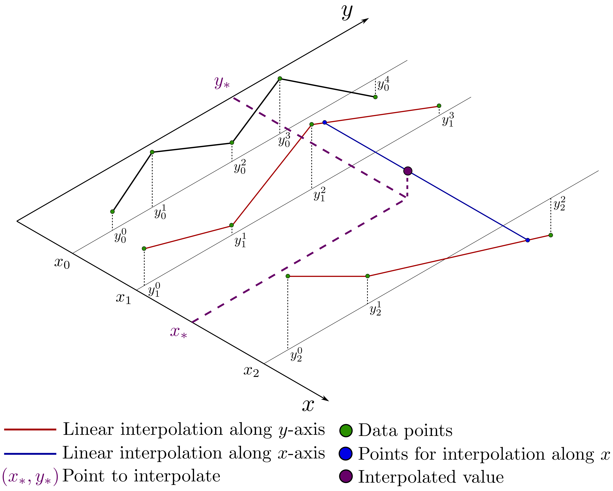

# JustInterp

## Integration

JustInterp is the single-header library, hence, you just need to copy `JustInterp.hpp` from `include_single/JustInterp` or release tab to your project.

```c++
#include "JustInterp/JustInterp.hpp"
```

Set the neccessary options to enable C++17, for example:

- Compiler flag: `-std=c++17` for GCC and Clang, `/std:c++17` for MSVC
- Using CMake:
    - Specify compile features for specific target: `target_compile_features(<target> <PRIVATE|PUBLIC|INTERFACE> cxx_std_17)`
    - Set global property: `set(CMAKE_CXX_STANDARD 17 CACHE STRING "The C++ standard to use")`

## Linear Interpolation

Piece-wise linear interpolation (https://en.wikipedia.org/wiki/Linear_interpolation).

```c++
#include "JustInterp/JustInterp.hpp"

std::vector<double> x, y;

// ...
// set points x and values y
// ...

// Define linear interpolator and set data
JustInterp::LinearInterpolator<double> interpolator(x, y);

// Interpolate at the specific point
double result = interpolator(3.5);

// Interpolate at the array of points
std::vector<double> point_array{1.5, 2.5, 3.5};
std::vector<double> results = interpolator(point_array);
```

### How to set data

1. Using constructor:
    ```c++
    JustInterp::LinearInterpolator<double> interpolator(x, y);
    ```
    `x.size()` and `y.size()` must be equal.
2. Using `SetData` method:
    ```c++
    JustInterp::LinearInterpolator<double> interpolator;
    interpolator.SetData(x, y);
    ```
    `x.size()` and `y.size()` must be equal.
3. Using `SetData` method for data pointers:
    ```c++
    JustInterp::LinearInterpolator<double> interpolator;
    interpolator.SetData(x.size(), x.data(), y.data());
    ```
    It is assumed that arrays `x.data()` and `y.data()` of the same size of `x.size()`.

### Extrapolation

There are two avaliable types of [extrapolation](https://en.wikipedia.org/wiki/Extrapolation):
1. (Default) `JustInterp::ConstantExtrapolation`
    ```c++
    JustInterp::LinearInterpolator<double, JustInterp::ConstantExtrapolation> interpolator;
    /* or */
    JustInterp::LinearInterpolator<double> interpolator;
    ```
2. `JustInterp::LinearExtrapolation`
    ```c++
    JustInterp::LinearInterpolator<double, JustInterp::LinearExtrapolation> interpolator;
    ```



## Bilinear Interpolation

Bilinear interpolation (https://en.wikipedia.org/wiki/Bilinear_interpolation).

### Input data format

- `x_1d` - grid coordinates along x-axis
- `y_1d` - grid coordinates along y-axis
- `z_all` - values at all grid points. 1D array of size `x_1d.size() * y_1d.size()`.

There are two avaliable storage orders for `z_all`:
- `YMajor` - default storage order, see left figure.
    ```c++
    JustInterp::BilinearInterpolator<double, JustInterp::YMajor> interpolator(x_1d, y_1d, z_ymajor);
    ```
    or equivalent
    ```c++
    JustInterp::BilinearInterpolator<double> interpolator(x_1d, y_1d, z_ymajor);
    ```
- `XMajor` - see right figure
    ```c++
    JustInterp::BilinearInterpolator<double, JustInterp::XMajor> interpolator(x_1d, y_1d, z_xmajor);
    ```



### Example of usage

```c++
#include "JustInterp/JustInterp.hpp"

std::vector<double> x_1d, y_1d;
std::vector<double> z_ymajor;

// ...
// set grid points x_1d, y_1d along corresponding direction
// ...

// ...
// set z_ymajor values according to YMajor order
// ...

// Define bilinear interpolator and set data
JustInterp::BilinearInterpolator<double> interpolator(x_1d, y_1d, z_major);

// Interpolate at the specific point
double result = interpolator(3.5, 2.0);

// Interpolate at the array of points
std::vector<double> points_x{ 0.3,  0.6, 1.5};
std::vector<double> points_y{-1.3, -0.4, 3.2};
// result is the array of size points_x.size() = points_y.size()
std::vector<double> results = interpolator(points_x, points_y);

// Interpolate to destination grid
std::vector<double> x_1d_dest, y_1d_dest;
// ...
// fill destination grid
// ...
// results_dest is the array of size x_1d_dest.size() * y_1d_dest.size()
// storage order is the same to interpolator's storage order
std::vector<double> results_dest = interpolator.GridInterpolation(x_1d_dest, y_1d_dest);
```

### How to set data

1. Using constructor:
    ```c++
    JustInterp::BilinearInterpolator<double, JustInterp::YMajor> interpolator(x_1d, y_1d, z_ymajor);
    ```
    or
    ```c++
    JustInterp::BilinearInterpolator<double, JustInterp::XMajor> interpolator(x_1d, y_1d, z_xmajor);
    ```
    Size of `z_ymajor` or `z_xmajor` must be equal to `x_1d.size() * y_1d.size()`.
2. Using `SetData` method:
    ```c++
    JustInterp::BilinearInterpolator<double, JustInterp::YMajor> interpolator;
    interpolator.SetData(x_1d, y_1d, z_ymajor);
    ```
    or
    ```c++
    JustInterp::BilinearInterpolator<double, JustInterp::XMajor> interpolator;
    interpolator.SetData(x_1d, y_1d, z_xmajor);
    ```
3. Using `SetData` method for data pointers:
    ```c++
    JustInterp::BilinearInterpolator<double, JustInterp::YMajor> interpolator;
    interpolator.SetData(x_1d.size(), y_1d.size(), x_1d.data(), y_1d.data(), z_ymajor.data());
    ```
    or
    ```c++
    JustInterp::BilinearInterpolator<double, JustInterp::XMajor> interpolator;
    interpolator.SetData(x_1d.size(), y_1d.size(), x_1d.data(), y_1d.data(), z_xmajor.data());
    ```

### Extrapolation

## Table Interpolation

